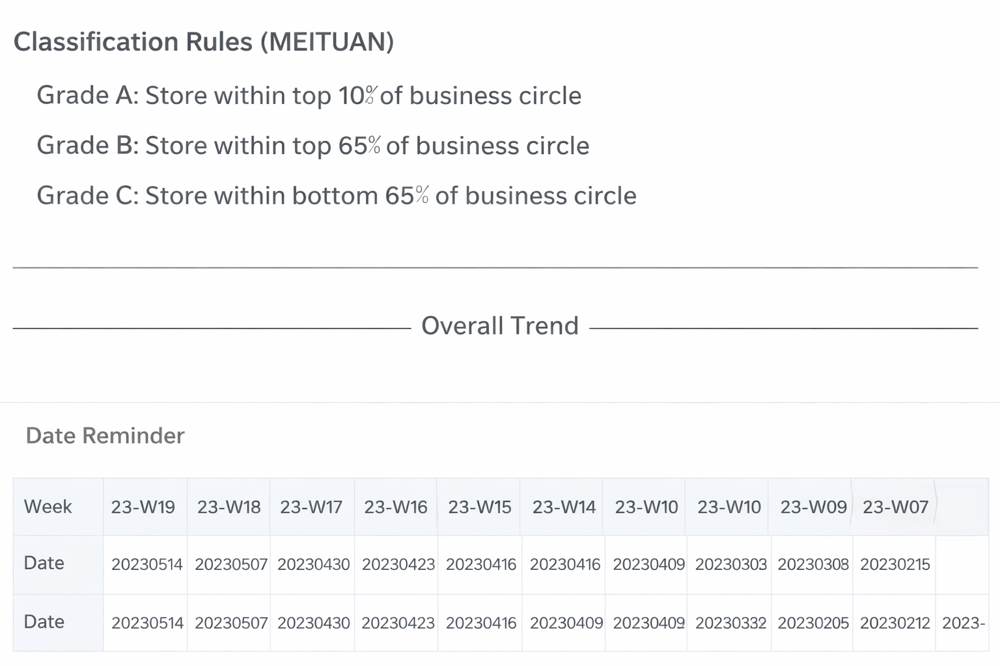
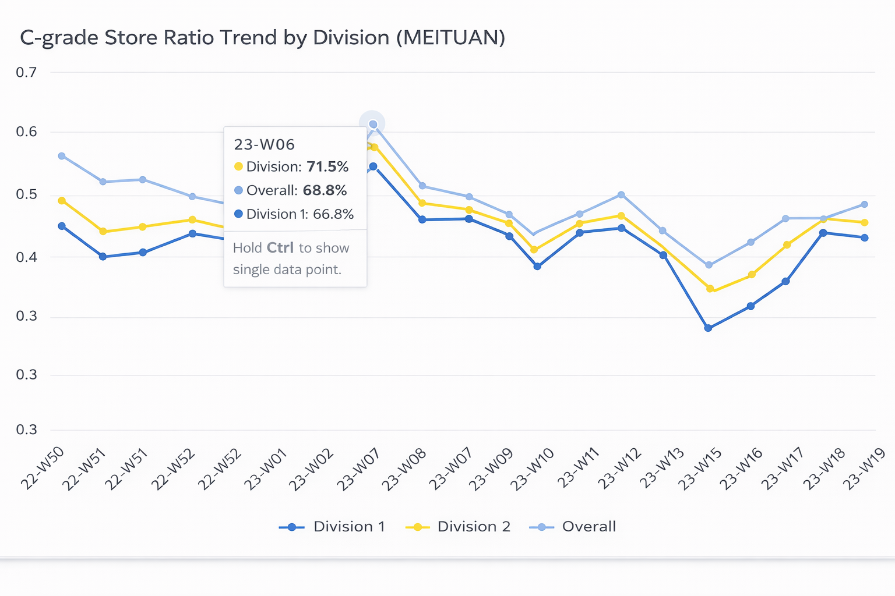
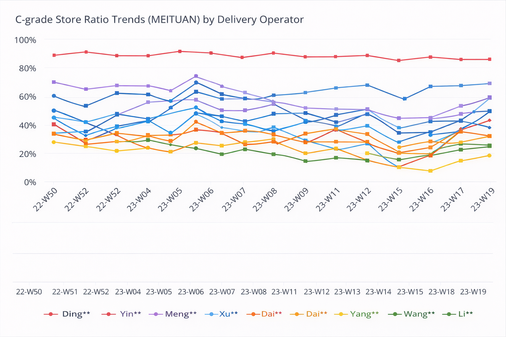
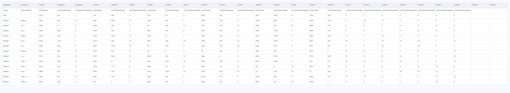
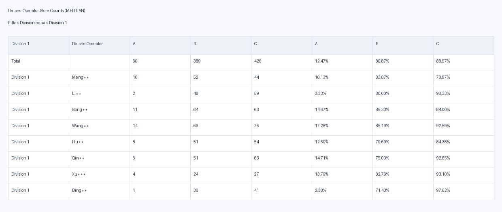
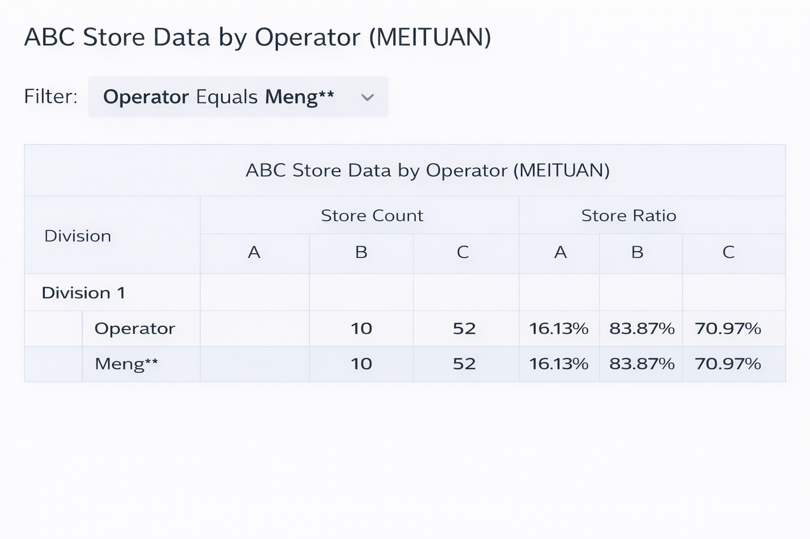

# C-grade Store Risk Monitoring & Responsibility Attribution Dashboard (Meituan)

A BI deliverable for monitoring **C-grade store risk** and enabling **responsibility attribution** across divisions and delivery operators.

---

## What this dashboard is for

Luckin Coffee is in a rapid expansion phase, and store performance quality varies across regions.  
This dashboard helps operational teams quickly answer:

- Is the overall risk (C-grade store ratio) improving or deteriorating?
- Which division is improving faster?
- Which delivery operators need attention, and where should we drill into next?

> Detailed data model, table joins, metric definitions, and drill-down design are documented in **`modelling.md`**.

---

## Dashboard Pages

### P1 — Definitions & Date Reference

**Intent:** Provide quick context for how stores are classified and how week numbers map to calendar dates.

---

### P2 — C-grade Store Ratio Trend by Division

**Intent:** Track the overall C-grade store ratio trend and compare **Division 1 vs Division 2** performance improvement.

---

### P3 — C-grade Store Ratio Trends by Delivery Operator

**Intent:** Evaluate individual delivery operator performance over time by comparing C-grade store ratio trends.

---

### P4 — Weekly Detail Table (Drill-down Enabled)

**Intent:** Weekly operational detail view showing C-grade store ratio, WoW change, and improvement ranking—used as an entry point for drill-down.

#### Drill-down: Division → Operators

**Intent:** After selecting a division, view each operator’s **A/B/C store distribution** (counts and ratios).

#### Drill-down: Operator → Operator-level breakdown

**Intent:** After selecting an operator, inspect the operator’s **A/B/C store composition** for deeper responsibility diagnosis.

---

## Documentation

- **Data model diagram:** `data_model.png`
- **Modeling & metrics:** `modelling.md`

